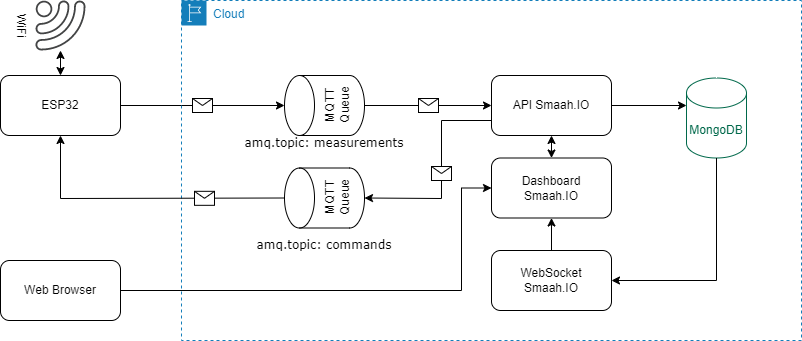

# Smaah.io

## O que é e para que serve o "Smaah.io" ?
Horticultura doméstica inteligênte: Uma proposta de automação para controle e gerenciamento de irrigação com prototipação por ESP32 e plataforma web. 

## O que significa "Smaah"?

É um *acrônimo* de Smart Agriculture At Home.
Provavelmente não é o melhor nome do mundo, mas é o único temos! Se você tiver uma ideia para um nome melhor, avise-nos.😊

## Como funciona?

Através de um microcontrolador ESP-WROOM-32 com os módulos RTC DS3231, sensor de umidade de solo, relé 5V JQC-3FF-S-Z, sensor de temperatura e umidade DHT11 e uma bomba d'água QR30E ligados, o protótipo coleta, envia e recebe dados através da comunicação/controle via internet (TCP/IP) e uso do protocolo MQTT. O dados são armazenados em uma base de dados NoSQL MongoDB na nuvem e são disponibilizados em tempo real uma interface web.
